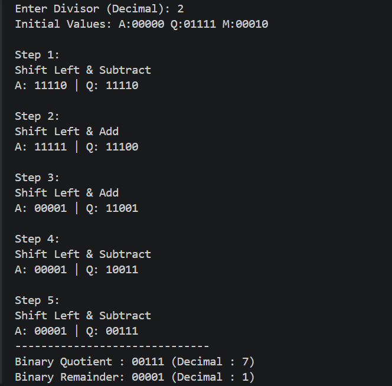

# Lab 10: Program to Implement the Non-Restoring Division Algorithm

## Objective
- To understand the Non-Restoring Division Algorithm for unsigned binary numbers.
- To implement the algorithm in Python.
- To verify the correctness of the algorithm using different test cases.

---

# Theory

The **Non-Restoring Division Algorithm** is an efficient binary division technique used for dividing unsigned binary numbers. Unlike the Restoring Division Algorithm, it eliminates the need to restore the partial remainder after every unsuccessful subtraction, making the division process faster and more efficient.

The algorithm uses three registers:

- **A (Accumulator):** Stores the partial remainder.
- **Q (Quotient Register):** Initially contains the dividend and finally stores the quotient.
- **M (Divisor Register):** Stores the divisor throughout the operation.

During each iteration, the combined register **(A, Q)** is shifted left by one bit. Depending on whether the accumulator is positive or negative, either subtraction or addition of the divisor is performed.

- If **A ≥ 0**, subtract the divisor from A.
- If **A < 0**, add the divisor to A.

After the operation:

- If **A ≥ 0**, the least significant bit of Q is set to **1**.
- If **A < 0**, the least significant bit of Q is set to **0**.

After completing all iterations, if the accumulator is still negative, one final correction is performed by adding the divisor back to the accumulator. The quotient is then stored in **Q**, while **A** contains the remainder.

---

# Results

The Non-Restoring Division Algorithm was successfully implemented and tested using different input values. The program correctly performed binary division by updating the accumulator and quotient registers in each iteration. The final quotient and remainder matched the expected results for all valid test cases.

## output

# Conclusion

The Non-Restoring Division Algorithm provides an efficient method for performing binary division by avoiding the repeated restoration step used in the restoring division algorithm. This reduces the number of arithmetic operations and improves execution efficiency. The lab demonstrates the complete working of the algorithm and verifies that it correctly computes the quotient and remainder for unsigned binary numbers.
