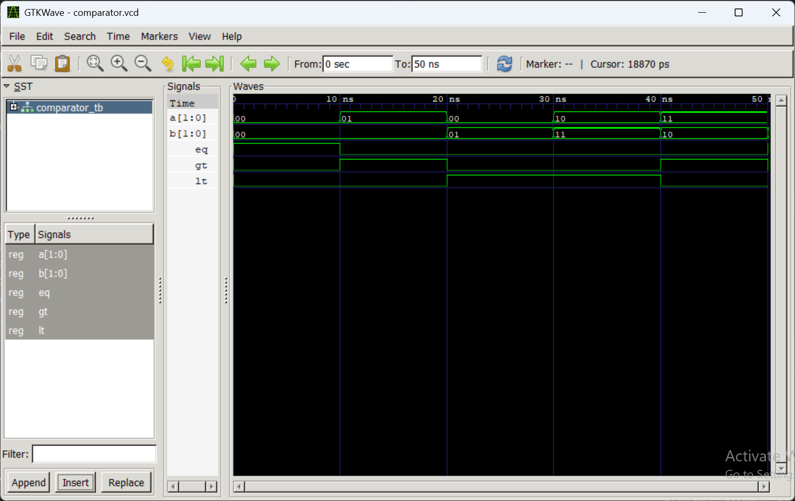

**Lab 5: VHDL Code for Combinational Circuits: Comparator**

**Objective**
• To design and simulate a 2-bit magnitude comparator in VHDL.
• To understand how comparison operations are implemented in hardware.

**Theory**
A magnitude comparator compares two binary numbers and produces three output signals:
• EQ (Equal): HIGH when A = B
• GT (Greater Than): HIGH when A > B
• LT (Less Than): HIGH when A < B
For a 2-bit comparator with inputs A = A1A0 and B = B1B0:
EQ = A1 ⊕ B1 · A0 ⊕ B0
GT = A1B1 + A1 ⊕ B1 · A0B0
LT = A1B1 + A1 ⊕ B1 · A0B0

**Table: Expected Output of 2-bit Magnitude Comparator**

| A  | B  | EQ | GT | LT |
|----|----|----|----|----|
| 00 | 00 | 1  | 0  | 0  |
| 01 | 00 | 0  | 1  | 0  |
| 00 | 01 | 0  | 0  | 1  |
| 10 | 11 | 0  | 0  | 1  |
| 11 | 10 | 0  | 1  | 0  |
| 11 | 11 | 1  | 0  | 0  |

**output**

**Discussion**
The 2-bit magnitude comparator was designed and simulated successfully using VHDL. It compares two 2-bit inputs (A and B) and produces three outputs: EQ, GT, and LT. The simulation showed that EQ becomes HIGH when A = B, GT when A > B, and LT when A < B. All test cases produced the expected outputs, confirming the correct operation of the comparator and demonstrating the effectiveness of VHDL for modeling and verifying combinational circuits.

**Conclusion**
The objective of designing and simulating a 2-bit magnitude comparator in VHDL was successfully achieved. The comparator correctly compared two 2-bit binary numbers and generated the appropriate EQ, GT, and LT output signals for all test cases. The simulation results matched the expected outputs, confirming the correctness of the design. This experiment improved the understanding of combinational logic design, comparison operations, VHDL programming, and hardware simulation techniques.
