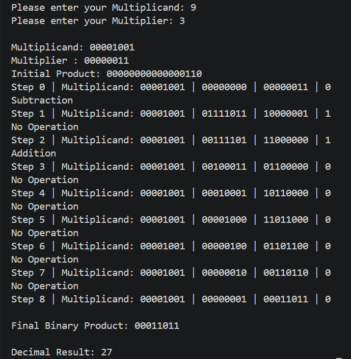

# Lab 9: Program to Implement the Booth Algorithm

## Objective

- To understand the Booth multiplication algorithm for signed binary numbers.
- To implement Booth's Algorithm for multiplication using two's complement representation.
- To verify the correctness of the algorithm with different test cases.

---

## Theory

Booth's Algorithm is an efficient multiplication algorithm developed by Andrew D. Booth in 1951 for multiplying signed binary numbers represented in two's complement form.

Unlike the conventional binary multiplication method, Booth's Algorithm reduces the number of addition and subtraction operations by identifying consecutive sequences of 1s in the multiplier. This makes the algorithm faster and more efficient, especially in computer architecture and processor design.

The algorithm uses three registers:

- **A (Accumulator):** Stores intermediate results.
- **Q (Multiplier):** Contains the multiplier.
- **Q-1:** An extra bit used to determine the required operation.

During each iteration, the algorithm examines the least significant bit (Q₀) and the extra bit (Q-1). Based on their values, it performs one of the following operations:

| Q₀ | Q-1 | Operation |
|----|-----|-----------|
| 0 | 0 | No operation |
| 0 | 1 | A = A + M |
| 1 | 0 | A = A − M |
| 1 | 1 | No operation |

After the operation, the combined register **[A, Q, Q-1]** is shifted one bit to the right using an arithmetic right shift. This process is repeated **n** times, where **n** is the number of bits.

Finally, the multiplication result is obtained by combining the contents of **A** and **Q**.

---


## Input

- Signed Multiplicand
- Signed Multiplier

---

## Output

- Binary multiplication result
- Decimal multiplication result

---


## Sample Input

```
Multiplicand: 7
Multiplier: -3
```

---
## output



## Result

The Booth multiplication algorithm was successfully implemented and tested. The program correctly performs multiplication of signed binary numbers using two's complement representation and produces accurate binary as well as decimal results.

---

## Conclusion

The experiment demonstrates the implementation of Booth's Algorithm for signed binary multiplication. The algorithm efficiently minimizes arithmetic operations and correctly handles both positive and negative integers, making it suitable for high-speed computer arithmetic operations.

---

